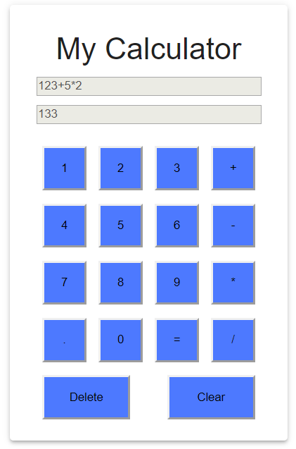

**my-calculator-using-redux is a very simple calculator created using basic ReactJs and Redux.Redux is used to maintain a centralized state rather than maintaining component specific state. It makes the code clean and maintainable.
The calculator supports basic mathematical operations such as addition, multiplication, subtraction and division.**

**Valid question pattern** - (operand) (operator) (operand)

**Examples :** 1+2, 3*4, 3-1/2

**Invalid question pattern -** (operand) (operator)

**Examples :** 1+2*, 08*2 (since cannot start with 0)

**Important points -**
1. Initially the operator buttons, equals button, delete and clear buttons are disabled because the first character that should be entered should be an operand.
2. If any invalid input is entered e.g. 5+2* then the output "Invalid input" error is shown on the "Your result" screen.
3. Delete button is used to delete the last character of the input.
4. Clear is used to clear the question.

**Note : The npm start script is configured to run on port 3005.**

This project was bootstrapped with [Create React App](https://github.com/facebook/create-react-app).

## Available Scripts

In the project directory, you can run:

### `npm start`

Runs the app in the development mode. 
Open [http://localhost:3005](http://localhost:3005) to view it in the browser.

**Hosting the application to firebase**
1. Create a build of your application by running the command **npm run build** in your application's root directory.
This will create a build folder containing your static build files along with the entry point file of your application i.e.     index.html.

2. Go to the firebase hosting steps from your firebase console and follow the instructions as below by running it in application's root directory,

    a. Install firebase commandline tools with command **npm install -g firebase-tools**.

    b. Login to firebase using your google account, **firebase login**.

    c. Initialize your firebase project, **firebase init**.

    d. Finally deploy the application using command **firebase deploy**.
    
  3. You can get your hosted URL from your project hosting dashboard in firebase console.
  
  Check my calculator - https://my-calculator-using-redux.firebaseapp.com/
